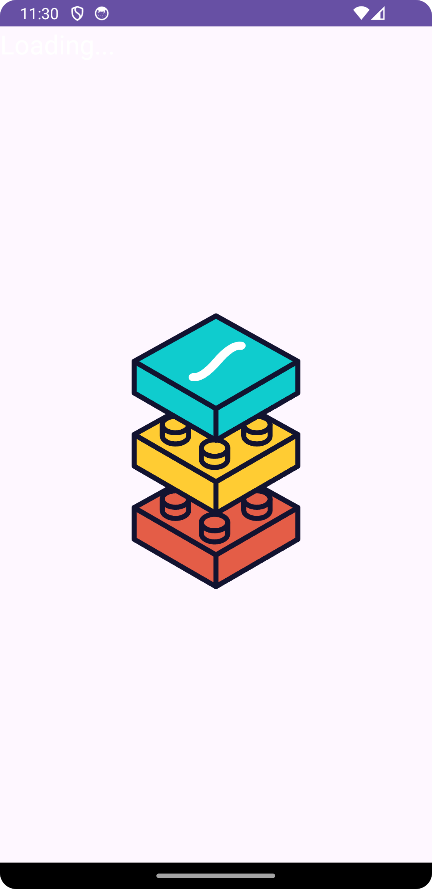
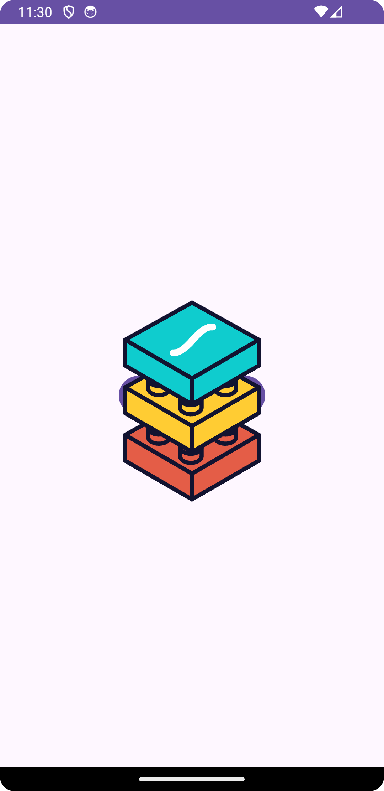

# App Name

## Splash Activity

### Description
The Splash Activity of the app displays a loading animation using LottieAnimationView. Upon launching the app, this activity briefly appears before transitioning to the main content.

### Features
- Display a Lottie animation on launch.
- Transition to the Main Activity after a specific duration.

### Implementation
The Splash Activity is implemented using a ConstraintLayout containing a LottieAnimationView and TextView.

##images

